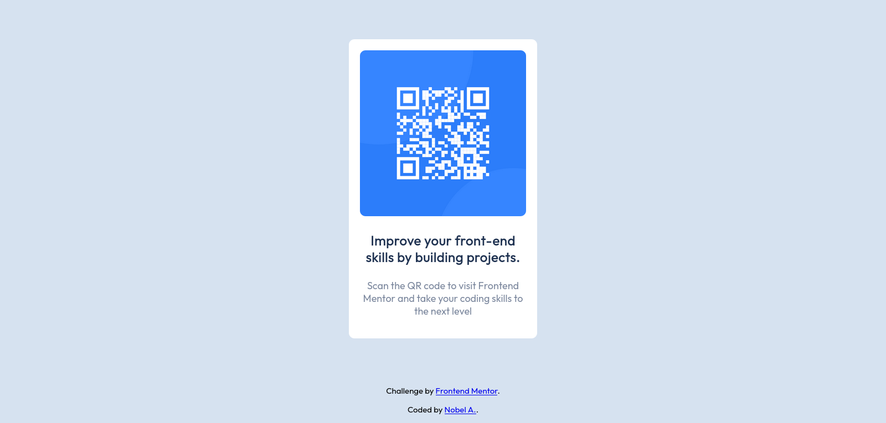

# Frontend Mentor - QR code component solution

This is a solution to the [QR code component challenge on Frontend Mentor](https://www.frontendmentor.io/challenges/qr-code-component-iux_sIO_H). Frontend Mentor challenges help you improve your coding skills by building realistic projects. 

## Table of contents

- [Frontend Mentor - QR code component solution](#frontend-mentor---qr-code-component-solution)
  - [Table of contents](#table-of-contents)
  - [Overview](#overview)
    - [Screenshot](#screenshot)
    - [Links](#links)
  - [My process](#my-process)
    - [Built with](#built-with)
  - [Author](#author)

**Note: Delete this note and update the table of contents based on what sections you keep.**

## Overview

### Screenshot

### Links

- Solution URL: [Add solution URL here](https://github.com/nobelium-acc/frontend-mentor---qr-code-component-solution)
- Live Site URL: [Add live site URL here](https://nobelium-acc.github.io/frontend-mentor---qr-code-component-solution)

## My process

### Built with

- Semantic HTML5 markup
- CSS custom properties
- Flexbox
- Mobile-first workflow

## Author

- Website - [Add your name here](https://github.com/nobelium-acc)
- Frontend Mentor - [@nobelium-acc](https://www.frontendmentor.io/profile/nobelium-acc)

**Note: Delete this note and add/remove/edit lines above based on what links you'd like to share.**

